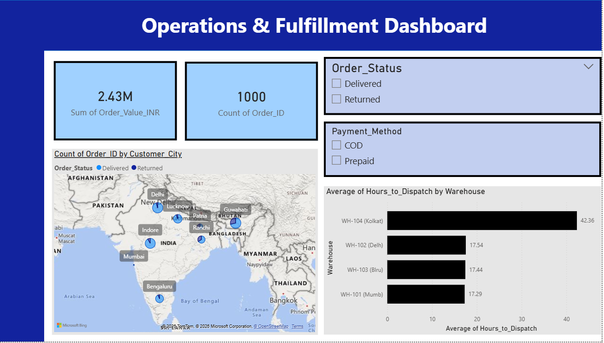

# E-Commerce Supply Chain & RTO Optimization Analytics

## 📌 Project Overview
This project simulates, cleans, and analyzes **1,000 e-commerce order records** to identify critical operational bottlenecks and capital leaks. By building an end-to-end data pipeline spanning **Python, SQL, and Power BI**, I isolated severe fulfillment delays in specific warehouses and localized high Return-to-Origin (RTO) risks driven by Cash-on-Delivery (COD) transactions in Tier-2 regions.

## 🛠️ Tech Stack & Workflow
1. **Data Engineering (Python):** Generated a synthetic master dataset using `random` with injected operational biases (SLA delays and geographic return patterns).
2. **Data Cleaning & Normalization (Python/Pandas):** Standardized case sensitivity, trimmed white spaces, and built a custom structural keyword-mapping function to group messy product titles into structured business categories.
3. **Advanced Database Querying (MySQL):** Stage-imported the cleaned dataset into a production schema to run multi-level aggregations (`GROUP BY`, `CASE WHEN`, `HAVING`) targeting financial vulnerabilities.
4. **Business Intelligence (Power BI):** Developed an interactive operational dashboard to present the validated metrics to executive stakeholders.

---

## 📈 Key Insights & Business Impact

### 1. First-Mile SLA Breaches (Warehouse Bottleneck)
* **The Leak:** The business mandates a strict 24-hour target turnaround time from order placement to dispatch. 
* **The Root Cause:** SQL profiling isolated **WH-104 (Kolkata)**, which exhibits a catastrophic average dispatch delay exceeding 40 hours, triggering downstream logistic failures.

### 2. Last-Mile RTO Risk Clusters (Reverse Logistics Drain)
* **The Leak:** High return rates drain margins due to double shipping costs without realized revenue.
* **The Root Cause:** Risk-factor cross-tabulation exposed that **Cash-on-Delivery (COD) orders in Patna and Ranchi** exhibit RTO rates climbing past 40%. Prepaid orders in the same regions remain entirely stable.

---

## 💻 Code Repository Directory

* `DA1.pbit`: Data Generation and data cleaning engine and text processors.
* `DA1_sql.sql`: Includes the execution scripts for operational auditing.
* `DA1.pbit`: The native Power BI workbook.

---

## 📊 Dashboard Preview

## 💡 Strategic Recommendations
1. **Dynamic Fulfillment Allocation:** Throttle intake orders assigned to WH-104 (Kolkata) during peak log-jams, routing regional orders to neighboring active hubs to stabilize fulfillment timelines.
2. **Risk-Mitigation Payment Friction:** Introduce a minor prepaid incentive or enforce automated verification checks on high-value COD carts destined for Patna and Ranchi to compress RTO liabilities.
